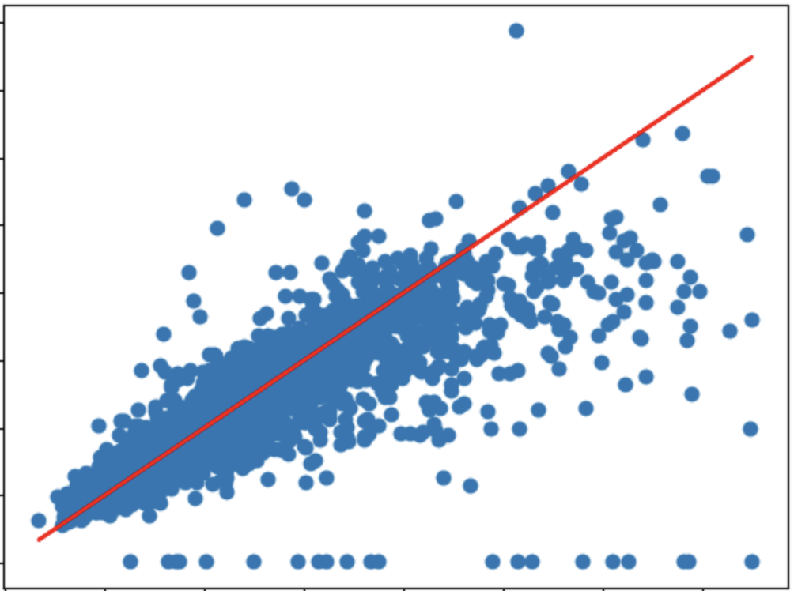
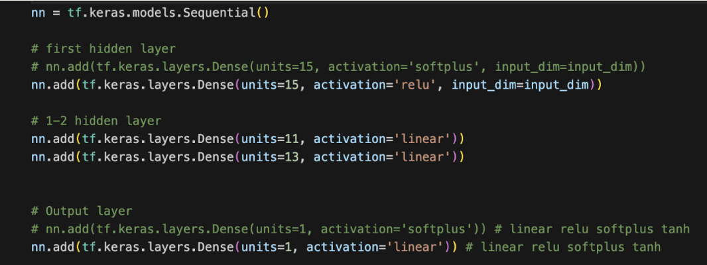

# nn_property_value_estimator 

### Predicting Property Values by Training Neural Networks.
Download the Keras Model [Here](models/redfin_property_estimator.keras)

## Project Repository Located: [Here](https://github.com/najtompkins/nn_property_value_estimator)
## Project Overview

This model was trained to predict the value of **single family homes in Dallas, TX** by evaluating features such as 1) number of bedrooms, 2) square footage, 3) zip code, etc, features gathered from [Redfin.com](https://www.redfin.com). The model is available for download in the [models](models/) directory as an .H5 or .Keras filetype. The development process of this neural network model included 4 team members, credited below.

*Note:* 
*This project was developed in collaboration as part of the 2023 UCF Data Analytics and Visualization Bootcamp.*

### Results
- Model metrics
  - **MAPE loss: 9.46..** Using the Mean-Absolute-Percentage-Error Loss function, we could evaluate our model based on how close it came to our target values. Our model predicts housing prices within ~9.4% of the target values.  
  
  - **mae: 40564.89..**. Indicates at first glance that our predictions, on average, are off by ~40.5k. *This is due to the high variance and low number of datapoints of houses above $1 million. Our primary metric is the above MAPE loss value.*  
  

- **Accuracy** - Predictions were, on average, within 9.4% of the target estimated value.  
- **Predictions Distribution** - Above the line are actual prices, below the line are predicted prices. Not the accuracy of anything below 800k (middle of the line)
        

- **Loss** = Final Epoch.   

### Team Members:   
**Martin Bedino**: GitHub: [mbedino99](https://github.com/mbedino99)  
**David Pinsky**: GitHub: [dpinsky1](https://github.com/dpinsky1)  
**Kaylee Patterson**: GitHub: [kayleepat](https://github.com/kayleepat)  
**Nathan-Andrew Tompkins (self)**: GitHub: [najtompkins](https://github.com/najtompkins)  

## Sourcing and Cleaning
There are 3 primary sources of the data used in training this model:
  1. List of Dallas addresses used in API call: [Dallas Central Appraisal District](https://www.dallascad.org/)
      * *Note* The list of cleaned addresses can be found in the [data](data/addresses_cleaned.csv) directory as cleaned: 
  2. [Redfin.com](redfin.com)
  3. [Redfin API Wrapper](https://github.com/reteps/redfin) developed by GitHub user "[reteps](https://github.com/reteps)"

## Kaylee Patterson - Data Aquisition and Processing 
  ### Data Aquisition
  - This model is trained on Redfin housing data pulled using a list of addresses located in Dallas, TX. These addresses were sourced from the [Dallas Central Appraisal District website](https://www.dallascad.org/). This downloadable .csv was then cleaned to remove any rows with empty values. This cleaned dataset can be found [here](data/addresses_cleaned.csv).
  - All other feature data was obtained from [Redfin](redfin.com) through the Redfin Wrapper cited above. The addresses from DCAD were reformatted to be used with a wrapper to access Redfin's unlisted API. (cleaning code [here](./code/ETL_addresses.ipynb).) This wrapper allowed access to the data without violating Redfin's terms of use against webscraping. (below is an example of the wrapper's code)  
    
    

  - The code that pulls this data is located in in the [code](./code/) directory. ([File located here](./code/redfin_data_collector.ipynb))
     
    
    
      - *Due to the extreme length of time it took to pull data using this wrapper method these API calls were  done in batches of 10,000 addresses. These were exported as .csv files to the data folder and then concatenated into the [combined_file.csv](./data/combined_file.csv).*
      - *Despite procurring a list of over 600,000 addresses, the time constraints of this project permitted data extraction for only around 40,000 homes. (Though this was more than enough to train the model.)*
    
## Martin - Statistical Analysis of Training Data
  - Training data extracted from the Redin Wrapper was analyzed so that we could better understand how to process the data further before training our model on it.
    - We used analytical and visualization tools such as MatplotLib, Seaborn, SKLearn, ScyPi to better understand the shape and scope of the data. 
    - We performed statisatical analysis to understand the correlations between the variables in our data and our target variable of home prices.
    - Our data was cleaned in order to better account for outliers, visualize upper and lower bounds, as well as test for normality
  - We performed a preliminary OLS regression of the coefficients in order to visualize the validity of our data for further tuning.
    - The data was tested to ensure it clears the classical assumptions.
      - We found a small but possible instance of autocorrelation
      - We found the data to be homoskedastic
      - There is no perfect linear relation between home prices and our explanatory variables
  - From this quick analysis we find a adjusted. r^2 value of 0.678, meaning there is room for improvement of the model through hyperparameter tuning.
 

 

 

 

## Nathan-Andrew Tompkins - Model Architecture and Tuning
  ### Code: [Here](code/nn_model_training.ipynb), Keras Model: [Here](models/redfin_property_estimator.keras)
  ### Keras Tuner structure
  - Using the Keras-Tuner library, our hyperparameter tuning function initializes a Sequential keras model and uses four separate activation functions to test on for the hidden layers: 'relu', 'tanh', 'linear', 'softplus'.
  - The tuner-function was set to choose between 2 and 20 layers, each comprised of up to 20 neurons each.
  - The output layer was designed to have a single output, which would be the predicted house price.
  - As this was not a classic example of a model designed to cluster or classify data and instead predict a numerical value close to the actual value, it became neccesary to find a proper loss and evaluation method.
    - Our loss function was the "Mean Absolute Percentage Error" function. This allowed for our model to test the data's accuracy within a certain percentage of the target instead of exacting values.
    - The MAE metric was used to determine the average value that the model was off in it's pricing estimation. (Note that this value is greater than expected due to the high variance of housing prices above 2.5 million.) 

  - The tuner-hyperband itself is initialized using the tuning-function as the first parameter. The "objective" here is "val_loss" as the primary function of this model is to reduce the percentage error between predicted and target vales. Likewise, the model callback/checkpoint "mode" variable is looking for the minimal value of the loss function to determine which tested model performs the best.

### Final model structure

  
  

  - Due to unexpected errors when using the best model determined by the keras-tuner, our final model uses only a few of those specifications. In the end, our model is Sequential and comprised of 4 layers:
    1. Input layer using the "relu" activaiton function
    2. Two hidden layers with 11 and 13 neurons respectively using the "linear" activation function.
    3. Output layer using the "linear" function.  

### Model Results

  - **loss: 9.46** Indicates that predicted housing prices are within ~9.4% of the target values.
  - **mae: 40564.8964**. Indicates at first glance that our data, on average, is off by ~40.5k. *Again, this is due to the high variance and low number of datapoints of houses above $1 million*.  
  
  
## David Pinsky - Data Visualization Dashboard
*A Tableau Public Visualization of the data can be found [here](https://public.tableau.com/app/profile/nathan.andrew.tompkins/viz/redfin_training_analysis/Story1?publish=yes), or downloaded [here](redfin_training_analysis.twbx).*

The visualizations within the Tableau Public dashboard are desinged to illustrate the full Redfin-extracted dataset as well as our compare it to our cleaned_data.csv.

### Our model's performance. 

The visualizations below illustrate the accuracy of our pricing model. While there are small differences the key takeaway is that these images look largely the same, meaning that our model predicted price-ranges in a substantially accurate way.

### Results
Using size and color to illustrate the prices of the homes, we can see that the while there are small differences between the actual and predicted maps, our model was trained with a satisfying degree of accuracy so that at these look largely the same.

*Actual Prices*
 

*Predicted Prices*
 

### Data Cleaning
Much of the data taken from Redfin included features for houses that significantly skewed some of our features. These multi-million dollar mansions included large interior and lot sizes, as well as over-represented bathroom and bedroom counts in the data. As these mansions were not in the scope of our model we elimented them from the training dataset, allowing for greater stability and accuracy in the single-family-home predictions model we devloped.
 

### Zip Code API Pulls.
Due to the limits of this project of our data is not as securly balanced as we would have otherwise striven for. As you can see below a vast majority of addresses we accessed and trained on were pulled from the northeast districts of Dallas, or other singlulary districts around the region. Nearly all were represented, but the model is weighted heavily toward home prices in those areas.
 

### Actual vs. Predicted
Above the line we can see the acutal house values and below the line we can see the predicted values from our model. We can see that houses below 800k are predicted with a high degree of accuracy and those above, where training data was not as available, were predicted with a lower degree of accuracy. This is the reason for the MAE value of 40564.8964. At first this metric would indicate that the average value of error in predictions is around 40K, but that number is drastically skewed due to houses with higher values in this data set. The 9.4% accuracy is the greater metric to evaluate this model due to this oddity in the MAE.
 

### Home Value Distribution - Actual
The home value distribution for all of the API data followed a normal distribution, peaking at with over 1,500 home in the 270k price bracket.
 

### Home Value Distribution - Predicted
The predicted home value distribution also followes a normal distribution. 
 

### Proper Price Weight
We can see that our model properly weighted the relationship between the two price/sq.ft interior features.
 

# End of ReadMe.

### Thank you from our team!
